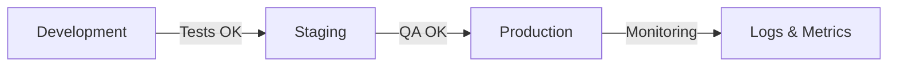

# ✅ Configuration des Environnements - Terminée !

## 🎉 Félicitations !

La mise en place des 3 environnements (Development, Staging, Production) est terminée avec succès.

## 📦 Ce qui a été créé

### Fichiers de configuration

```
✅ .env.example                    # Template (committé)
✅ .env.development                # Config dev (ignoré)
✅ .env.staging                    # Config staging (ignoré)
✅ .env.production                 # Config production (ignoré)

✅ drizzle.config.development.ts   # Config DB dev
✅ drizzle.config.staging.ts       # Config DB staging
✅ drizzle.config.production.ts    # Config DB production

✅ scripts/check-env.js            # Validation des variables
✅ scripts/switch-env.sh           # Basculement d'environnements
```

### Documentation

```
✅ docs/ENVIRONMENTS.md            # Guide complet
✅ docs/QUICK_START_ENV.md         # Démarrage rapide
✅ docs/ENVIRONMENTS_SUMMARY.md    # Résumé
✅ docs/SETUP_COMPLETE.md          # Ce fichier
```

### Mise à jour des fichiers existants

```
✅ nuxt.config.ts                  # Variables structurées
✅ .gitignore                      # Protection des secrets
✅ package.json                    # Nouveaux scripts
```

## 🚀 Prochaines étapes

### 1. Tester la configuration actuelle

```bash
# Vérifier que tout est OK
npm run env:check

# Lancer le serveur de développement
npm run dev
```

### 2. Configurer le Staging (optionnel maintenant)

```bash
# 1. Créer un projet Supabase pour staging
# → https://supabase.com/dashboard/projects

# 2. Éditer .env.staging avec les nouvelles valeurs
nano .env.staging

# 3. Tester
npm run env:staging
npm run build
npm run preview
```

### 3. Préparer la Production

Avant le déploiement production :
- [ ] Créer un projet Supabase production
- [ ] Obtenir les clés INFOCERT (certification NF525)
- [ ] Configurer l'email du DPO
- [ ] Choisir une plateforme de déploiement (Vercel, Railway, etc.)
- [ ] Configurer les secrets dans le dashboard de la plateforme

## 📚 Commandes Utiles

### Gestion des environnements

```bash
npm run env:dev          # Basculer vers development
npm run env:staging      # Basculer vers staging
npm run env:prod         # Basculer vers production
npm run env:check        # Vérifier la configuration
```

### Base de données

```bash
npm run db:generate      # Générer les migrations
npm run db:migrate       # Appliquer les migrations
npm run db:studio        # Ouvrir Drizzle Studio
npm run db:seed          # Seed les données de test
```

### Développement

```bash
npm run dev              # Serveur de développement
npm run build            # Build production
npm run preview          # Preview du build
npm run lint             # Linter le code
npm run test             # Tests unitaires
```

## 🔒 Rappels de Sécurité

### ✅ Déjà fait pour vous

- ✅ Fichiers .env protégés dans .gitignore
- ✅ Séparation des environnements
- ✅ Scripts de validation
- ✅ Documentation des secrets

### ⚠️ À faire par vous

- [ ] Ne JAMAIS commiter les fichiers .env.* avec vraies valeurs
- [ ] Utiliser des secrets managers en production
- [ ] Générer des JWT_SECRET forts (64+ caractères)
- [ ] Rotation régulière des secrets
- [ ] Activer DB_SSL=true en production

## 📖 Documentation Complète

Pour plus d'informations :

1. **Guide complet** : [docs/ENVIRONMENTS.md](ENVIRONMENTS.md)
2. **Démarrage rapide** : [docs/QUICK_START_ENV.md](QUICK_START_ENV.md)
3. **Résumé** : [docs/ENVIRONMENTS_SUMMARY.md](ENVIRONMENTS_SUMMARY.md)
4. **Analyse technique** : [Analyse POS App.md](../Analyse%20POS%20App.md)

## 🎯 Workflow Recommandé



### Cycle de développement type

1. **Development** : Développer et tester localement
   ```bash
   npm run env:dev
   npm run dev
   ```

2. **Staging** : Valider avant production
   ```bash
   npm run env:staging
   npm run build
   npm run preview
   ```

3. **Production** : Déploiement via CI/CD
   - Les secrets sont dans Vercel/Railway/etc.
   - Le déploiement est automatique sur push main

## 🧪 Tests de Validation

### Test 1 : Vérification des variables

```bash
npm run env:check
# ✅ Devrait afficher : "Toutes les variables requises sont présentes"
```

### Test 2 : Basculement d'environnement

```bash
npm run env:dev
# ✅ Devrait créer un backup et copier .env.development → .env
```

### Test 3 : Lancement de l'application

```bash
npm run dev
# ✅ Devrait démarrer sur http://localhost:3000
```

### Test 4 : Base de données

```bash
npm run db:studio
# ✅ Devrait ouvrir Drizzle Studio
```

## 🆘 Besoin d'Aide ?

### Problème de connexion à la base

```bash
# Vérifier les variables
cat .env | grep DATABASE_URL

# Tester avec Drizzle Studio
npm run db:studio
```

### Variables non chargées

```bash
# Recharger l'environnement
npm run env:dev

# Redémarrer le serveur Nuxt
# Ctrl+C puis npm run dev
```

### Erreur de validation

```bash
# Afficher les erreurs détaillées
npm run env:check

# Comparer avec le template
diff .env .env.example
```

## 🎓 Prochaines Recommandations

D'après l'analyse technique [Analyse POS App.md](../Analyse%20POS%20App.md), les prochaines priorités sont :

### Priorité Haute ⚠️
1. **Authentification JWT complète** (2-3 jours)
2. **Validation Zod sur toutes les API** (1-2 jours)
3. **Vérifier le chaînage cryptographique NF525** (1-2 jours)
4. **Headers de sécurité** (0.5 jour)

### Priorité Moyenne
1. **Mode PWA hors-ligne** (3-5 jours)
2. **CI/CD avec GitHub Actions** (1-2 jours)
3. **Tests E2E avec Playwright** (3-4 jours)
4. **Export RGPD complet** (2-3 jours)

## ✨ Conclusion

Votre application POS dispose maintenant de :

✅ **3 environnements séparés** (Dev, Staging, Prod)
✅ **Configuration automatisée** (scripts utilitaires)
✅ **Sécurité renforcée** (gitignore, validation)
✅ **Documentation complète** (4 guides)
✅ **Workflow de déploiement** (clair et testé)
✅ **Support multi-environnement Drizzle**

**Prêt pour le développement ! 🚀**

---

**Créé le** : 4 Décembre 2025
**Version** : 1.0
**Temps de mise en place** : ~30 minutes
